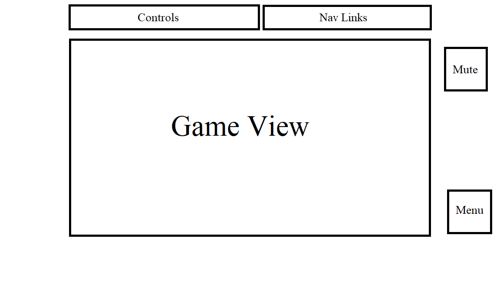

This project will be a 2d platformer in which the user will attempt to make it from point A to point B of the board/level. The player will control a character that can move left or right via left arrow key and right arrow key respectively, and the player will have the ability to jump vertically via spacebar. Ideally the later levels will have further interactions depending on the level via an action key mapped to the key F (This is not set in stone yet). There will be various obstacles and/or puzzles that will impede the player from reaching the goal (point B), such as but not limited to, pitfalls, buttons, moveable blocks, and much more.

The 5 major files will be seperated in 
board.js, which handles what is depicted, 
input.js, which will handle the controls the user inputs, 
game.js,  which will handle what the display will be showing
run.js,   which will handle the engine and what is happening at each instance of a players input
index.js  which will bring together all the other files and run the game

*potentially* physics.js which will handle things like gravity/velocity/collision detection

Some core features of the project will be:
-Various levels
-Puzzles/Obstacles that will require some planning
-Time based levels
-Collisions
-Moveable/pushable objects
-Music(maybe)

In addition, this project will include:
-A production README
-Game instructions and control explaintion

Nav links include links to this project's Github repo and acknowledgements to any references or assests used.

The controls will list out the keys needed to play the game

The mute button will turn off/on the game sound

The menu will allow the user to navigate through the levels

Technologies, Libraries, APIs

Canvas API to render the game board
Wepback to bundle and transpile the JS codes
Potentially animation libraries if the time allows for it

Implementation Timeline
Friday Afternoon & Weekend: Setup the enviroment and hopefully get the canvas to display the game view.
Look up references and tutorials to get an idea how the game should be laid out and how to implement certain
things like collision and physics. Becoming more comfortable with handling how each file will intertwine with
each other to create a functional game

Monday: If not already done with the board state, finish that, and start working on user input and how it'll affect
the characters movement. Be able to get a controllable object that will be able to move/jump. Depending on how far 
I get, start working on the physics/collision

Tuesday: Continue working on physics/collision and hopefully finish around halfway of the day. Start working on 
run.js which should handle what happens after the user inputs an action and how it'll reflect the board state. 
Start working on simple level designs to hopefully get be able to achieve a simple reflection of clearing a level.

Wednesday: If all things go as planned(which it probably wont), start working on adding features, puzzles, and interactable
objects in the level the player uses to achieve their goals. Add some more styling and hopefully get the game looking presentable.
If somehow time allows, try to make original bit music for the game.

Thursday: Last day polishing or bug fixing, and be ready to be able to push it onto the internet.

Bonus features:
Maybe someday allow multiplayer co-op and design stages that require two individuals to clear a level.